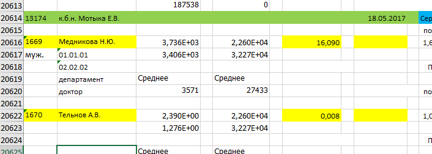

# Report-gen 

## Установка
- сохранить https://raw.githubusercontent.com/ppolushkin/report-gen/master/prod/install.ps1 в директории
- запустить install.ps1 с помощью powerShell (правая кнопка мыши -> выполнить с помощью)

## Использование

Перед тем как запустить нужно настроить параметры в **application.properties**:

- `excelLocation` - путь где лежит база. К сожалению, кирилица пока не работает.
- `sheetNumber` - номер Листа в базе (excel)
- `startLine` - зеленая линия, с которой начинается серия. См. картинку.
- `outputFolder` - директория в которую будут записаны результаты. Ее нужно заранее создать.

Чтобы запустить программу, нужно выполнить **generate.bat**

### Пример заполнения
   

На зеленой линии должен быть указан лаборант.
Первая дата - дата рождения, затем идет дата забора анализов.

